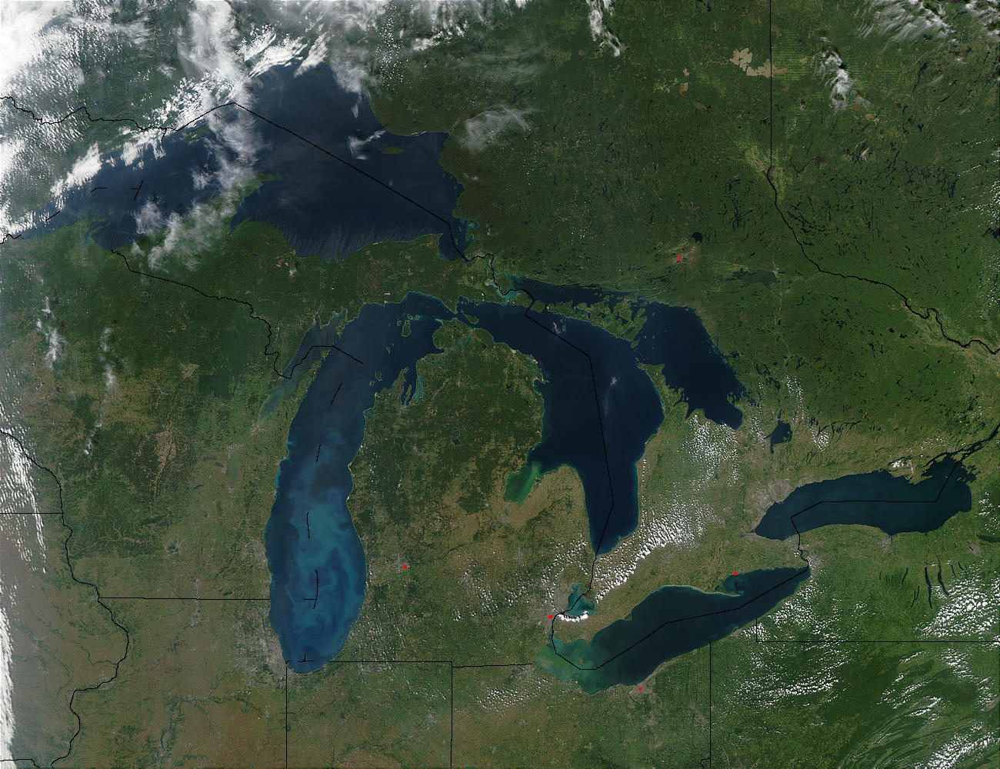

## Welcome !
  
Learn about land use and endangered wildlife in Michigan.

Using the left navigation panel you can find a map which visualizes this data.
  

The Great Lakes and the state of Michigan, as seen here from above, are regions that a large variety of wildlife calls home. It is also home to a large and expanding human population, and increased pressures from habitat loss and fragmentation are pushing some species to the brink. <i><a href='https://eoimages.gsfc.nasa.gov/images/imagerecords/68000/68562/GreatLakes.A2003260.1830.1km.jpg'>Image Source</a></i>