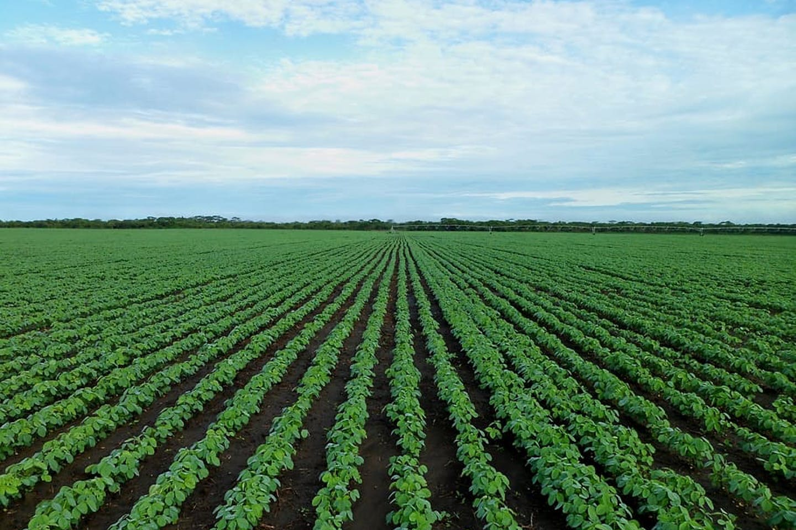

Currently totaling over 16.5% of the total land in Michigan, Agriculture can have many positive and
negative effects on wildlife species. Many species like the Eastern Blue Bird depend on natural praries and
grasslands for habitat and have seen population declines in the 20th Century due to the mass transformation from prarie to 
Farmland in the United States. However, some species like the Lesser Prairie Chicken depend almost entirely on farmland for habitat because of the unique cover many crops provide. 

  

Currently totaling over 6.5% of the total land in Michigan, Developed land and wildlife can coexist in many instances, but many species shy away from 
developed areas due to light pollution, noise, and unique habitat characteristics. However, some species depend on developed areas for survival, such as common Pigeons, Raccoons, and Opossoms.
Furthermore, developed areas are becoming increasingly wildlife friendly with the implimentation of green roofs, increased green spaces, and wildlife crossings. 

  

Currently totaling juest 1.5% of the total land in Michigan, Disturbed land is defined as areas experiencing extensive vegetation harvest, human altered ecological regimes,
and areas with uncontrolled spread of invasive species. Although these areas are sparse in Michigan, they can be inhabitable for many wildlife species. American Marten have been known to abandon clearcut areas frequently, and the spread of invasives can 
divert many species of passerine birds to newer unfamiliar areas. 
